# Project Two: Grazioso Salvare

#### Edgar I. Pena

#### Southern New Hampshire University

#### CS-340: Client/Server Development

## Introduction

In this project, our scenario was that Global Rain, a software company, was hired by Grazioso Salvare, an international rescue animal training organization. The goal was to build a dashboard that helps identify dogs that are good candidates for search and rescue training. The data comes from several animal shelters in the Austin, Texas area and is stored in a MongoDB database. Using this data, the dashboard allows users to search, filter, and visualize dogs based on specific traits that make them suitable for rescue work. For example, the company usually trains dogs that are no more than two years old, and certain breeds are better for specific rescue types like water, mountain, or disaster tracking. This README explains how the dashboard was designed, built, and tested, along with the tools used and the steps needed to reproduce the project.

## Tools Used

* MongoDB - Backend database for storing animal data.

* Python 3 - Core language used to implement logic and handle data.

* Pandas - For filtering, cleaning, and transforming MongoDB data.

* Dash Plotly - Framework for building interactive dashboards.

* Plotly Express - Used for creating visual charts like the pie chart.

* Dash Leaflet - Handles the interactive map display.

* JupyterDash - Allows the dashboard to run directly inside JupyterLab.

## Why MongoDB Was Used

MongoDB was chosen as the model component because it handles flexible data structures and integrates easily with Python. The Austin Animal Center dataset contains many irregular and nested fields that fit a document-based NoSQL database.

Key benefits:

* Dynamic schema supports records with varying structures.

* Fast querying and indexing for large datasets.

* Seamless integration with PyMongo for CRUD operations.

* Easy conversion of results into Pandas DataFrames for analysis.

## Dash Framework Overview

Dash serves as both the view and controller layers of the MVC model.

View Layer:

* Defines the layout and interface (filters, charts, tables, and map).

Controller Layer:

* Uses Python callback functions to process user input and update data dynamically.

This enables a fully interactive dashboard that refreshes without reloading the entire page.

## Resources and Software Links

[MongoDB](https://www.mongodb.com/docs/)

[Dash Plotly](https://dash.plotly.com/)

[Plotly Express](https://plotly.com/python/plotly-express/)

[Pandas](https://pandas.pydata.org/docs/)

[Dash Leaflet](https://www.dash-leaflet.com/)

[JupyterDash](https://dash.plotly.com/dash-in-jupyter)

[JupyterLab](https://jupyter.org/)

[Codio](https://www.codio.com/)

## Steps Taken to Complete the Project

1.  Imported the Austin Animal Center dataset into MongoDB using mongoimport.
2.  Created a user account “aacuser” and a password in MongoDB.
3.  Developed the CRUD_Python_Module.py file to manage database operations.
4.  Built the JupyterDash dashboard layout with logo, header, filters, and visual components.
5.  Connected the dashboard to MongoDB through the CRUD module.
6.  Implemented callback functions to handle table filtering, pie chart updates, and map rendering.
7.  Tested all dashboard features and validated functionality through interactive testing.

## Challenges and Solutions

| Challenge | Description | Solution |
| --- | --- | --- |
| Authentication Failure | MongoDB login errors due to missing authSource. | Added authSource='admin' in the CRUD module connection string. |
| ObjectID Error | _id field caused Pandas to crash. | Dropped _id column with df.drop(columns=['_id'], inplace=True). |
| Map Rendering Issue | Map failed when coordinates were not rendered as columns. | Kept location_lat and location_long as columns and will be a hidden columns in a future update. |
| Empty Data Errors | Dashboard displayed “NoneType” when no data returned. | Added if not viewData: checks before rendering visuals. |
| Column Organization | Columns appeared out of order in the data table. | Defined a visible column list and renamed headers using RENAME_MAP. |

# Required Functionality

This project implements an interactive data visualization dashboard for Grazioso Salvare, designed to help the company identify dogs suitable for specialized rescue training. The application connects to the Austin Animal Center’s MongoDB dataset (aac) and provides filtering, visualization, and mapping tools that allow users to explore animal data in real time.

## Key Features

*  **Interactive Layout and Branding**

The dashboard opens with the official Grazioso Salvare logo and project title displayed at the top, followed by the creator’s name for identification and documentation purposes.
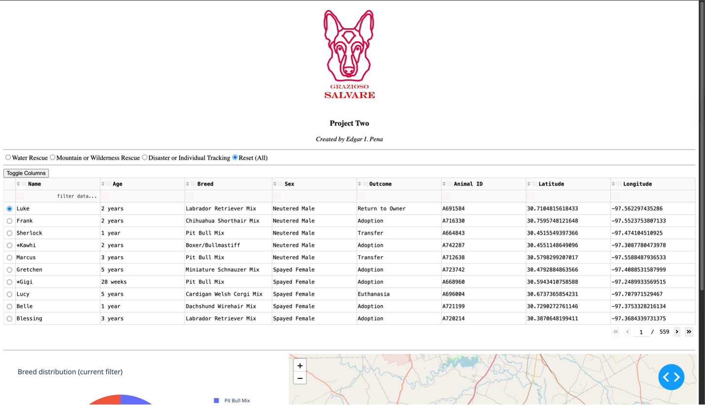

*  **Rescue Type Filters**

Radio buttons allow users to select between different rescue categories:

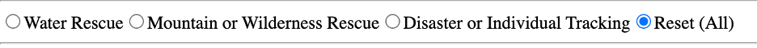

*  **Water Rescue** – filters Labrador Retrievers and similar breeds.

*  **Mountain or Wilderness Rescue** – filters German Shepherds, Border Collies, and Australian Shepherds.

*  **Disaster or Individual Tracking** – filters Beagles, Bloodhounds, and similar tracking breeds.

*  **Reset (All)** – restores the full dataset for browsing. These filters update the data table, breed chart, and map dynamically.
  
   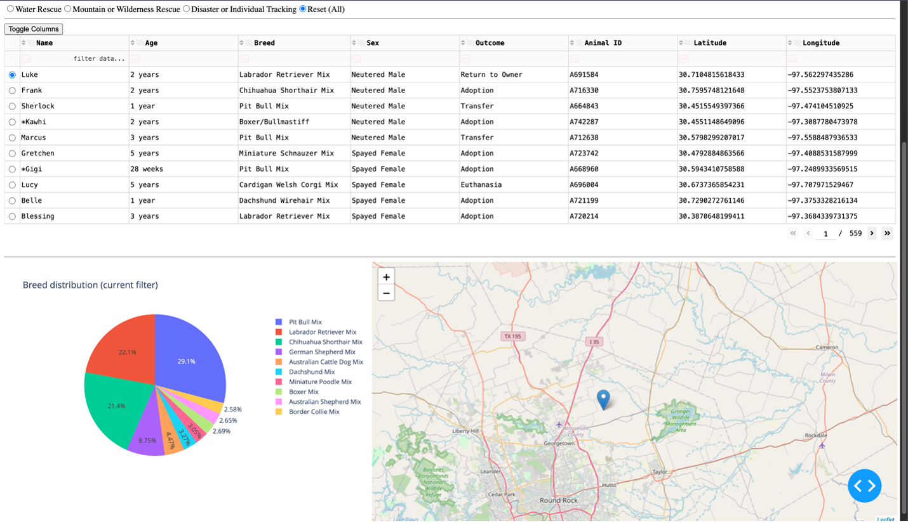

*  **Customizable Data Table**

The interactive data table displays dogs matching the selected filter.

*  Users can sort by any column, such as age ascending or descending.
  
  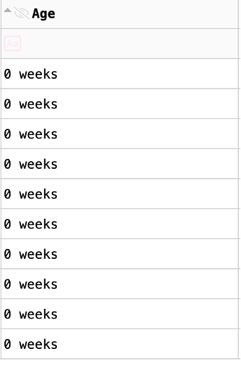  
  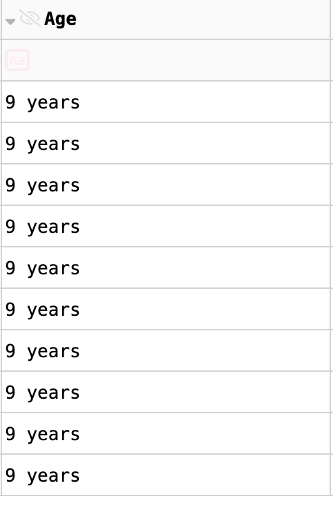

*  The Toggle Columns feature allows customization of the table view.
  
  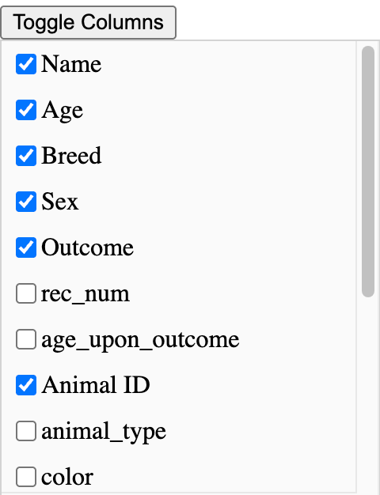
  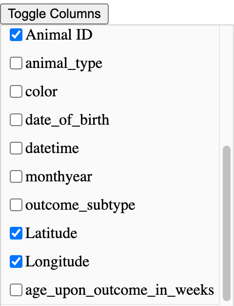

*  Key columns include _Name_, _Age_, _Breed_, _Sex_, _Outcome_, _Animal ID_, _Latitude_, and _Longitude_.

*  Hidden fields like rec_num or color can be made visible for deeper analysis when needed. Below shows the breed category being toggled on and off.
  
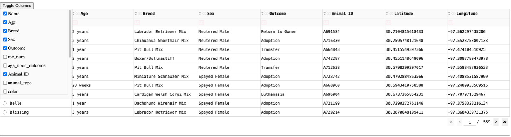

On

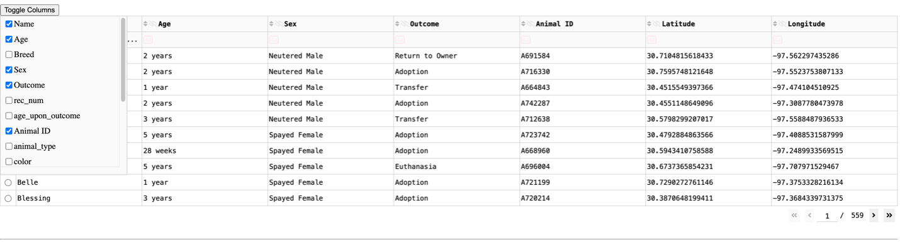

Off

*  **Breed Distribution Visualization**

A dynamic pie chart displays breed proportions based on the current filter.

*  When **Water Rescue** is selected, the chart shows 100% Labrador Retrievers.
  
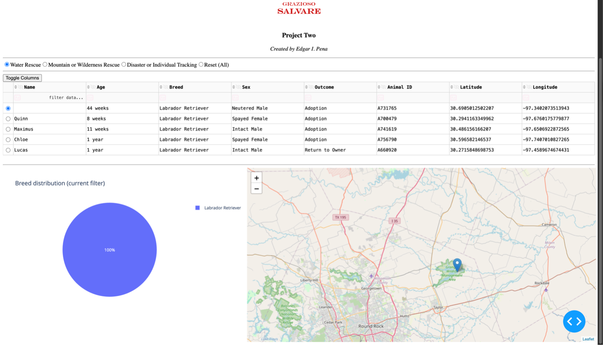

*  When **Mountain/Wilderness Rescue** is selected, the chart displays a mix of German Shepherds, Border Collies, and Australian Shepherds.
  
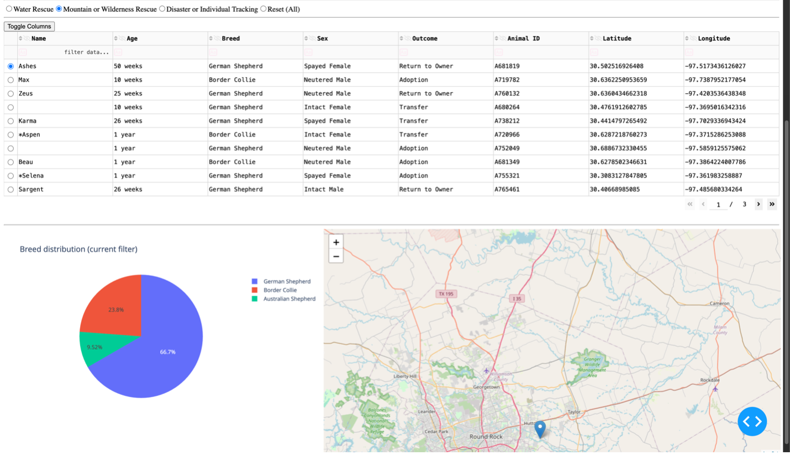

*  When **Disaster or Individual Tracking** is selected, Beagles and German Shepherds appear as the top breeds.
  
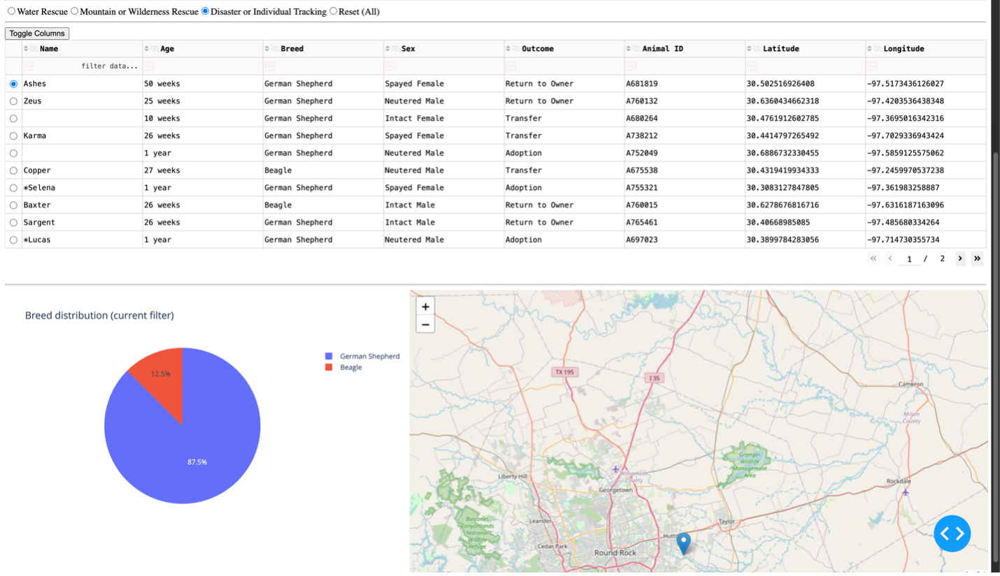

* **Geo-Location Mapping**

The map component automatically updates when a dog is selected in the table, marking its latitude and longitude coordinates. Each rescue category re-centers the map around Austin, Texas, visually showing where animals were adopted, transferred, or returned. The image below shows the category “Water Rescue” chosen and the dog “Chloe” selected. The map pin automatically updated with the location for this specific animal.

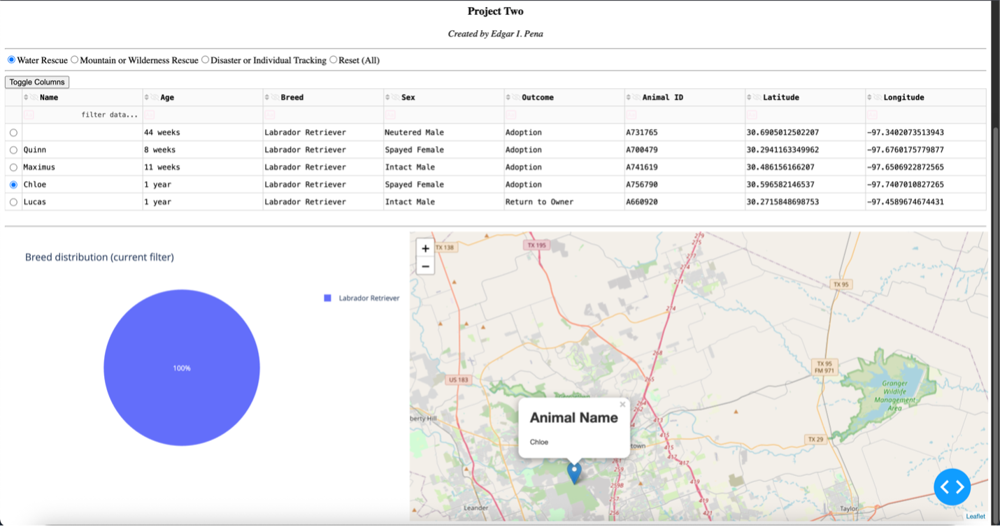

## Testing and Verification

All dashboard components were tested within JupyterLab using the built-in JupyterDash server. The interactive filters, data table, pie chart, and map were verified to update dynamically without manual page refresh. Authentication and MongoDB connection were validated through CRUD operations, confirming full read functionality.

## Future Updates

* Improve dashboard UI design and color scheme for readability.

* Add multiple search filters (age, breed, outcome type).

* Include CSV or Excel export options.

* Add a statistics panel showing total rescues and averages.

* Implement secure login authentication for users.

* Optimize MongoDB queries for performance through indexing and caching.

## Reflection

##### How do you write programs that are maintainable, readable, and adaptable?
I focus on writing modular and well-structured code so it’s easy to maintain and build upon. The CRUD Python module I built in Project One made working on the dashboard in Project Two much smoother, as all database operations were handled in one place. That kept the dashboard code cleaner and easier to manage. It also made it simple to make changes without breaking anything else. In the future, I could reuse this CRUD module for other projects that use MongoDB, like a new dashboard or a small web app—just by updating the queries or connection details.

##### How do you approach a problem as a computer scientist?
When I’m faced with a new problem, I like to break it down into smaller parts and determine which data, features, and outcomes are needed. For the Grazioso Salvare project, I started by getting familiar with the MongoDB data, then planned how to show that information clearly in the Dash dashboard. My goal was to make sure the user interface and the database worked together smoothly. This project felt more hands-on and client-focused than earlier ones, where I really had to think about how someone would use the tool. In the future, I’d approach similar projects the same way by defining what users need first and then designing the database and visuals to match.

##### What do computer scientists do, and why does it matter?
Computer scientists use technology to solve real-world problems and help people make better use of data. In this project, I built a dashboard that helps Grazioso Salvare find animals suited for search-and-rescue training. That kind of tool makes it easier for the organization to make quick, informed decisions based on real data. It’s rewarding to see how something you build can turn complex data into insights that actually help people and animals. Projects like this show how computer science can make a real difference by combining data, design, and problem-solving to support meaningful work.

